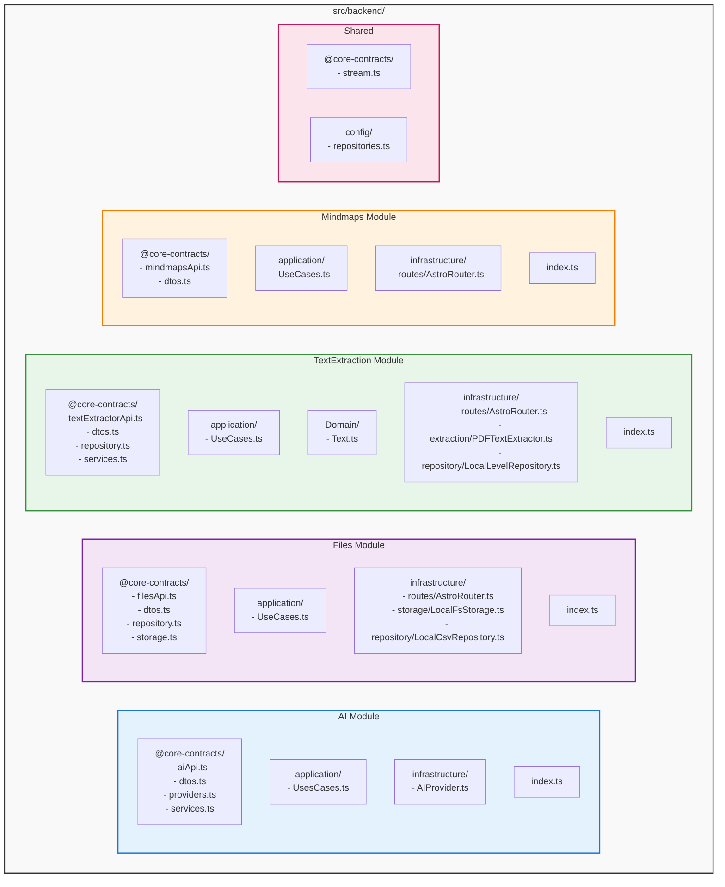
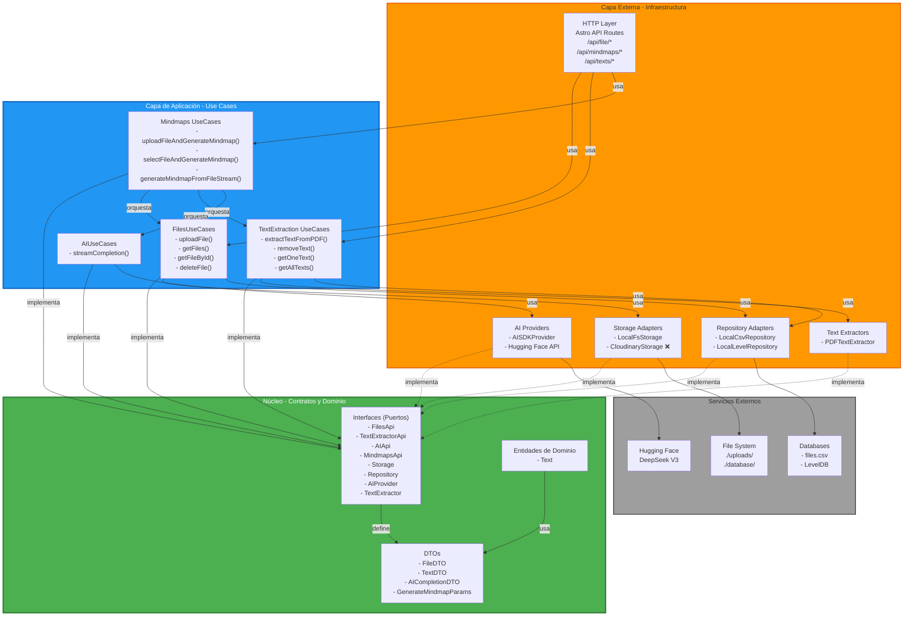
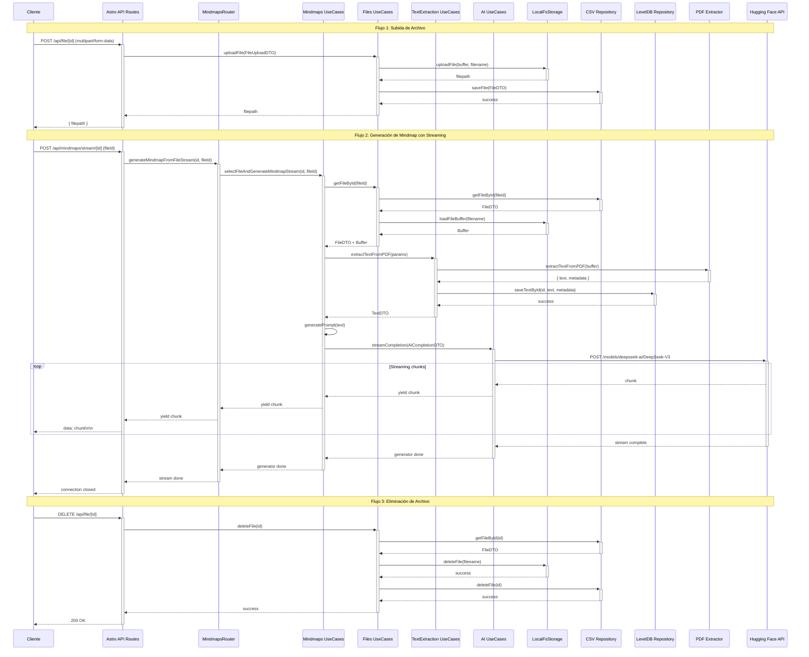
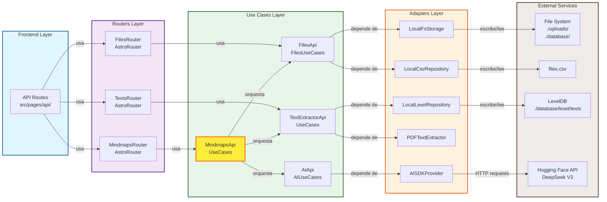
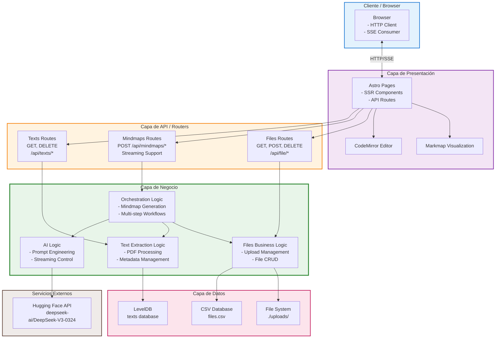

# Diagramas de Arquitectura - MindmapAI Backend

Este documento contiene los diagramas completos de la arquitectura del backend de MindmapAI.

---

## 1. Diagrama de Estructura de Directorios y Módulos

---

## 2. Diagrama de Arquitectura Hexagonal (Clean Architecture)

---

## 3. Diagrama de Flujo de Datos Completo

---

## 4. Mapa de Dependencias entre Módulos

---

## 5. Diagrama de Dependencias de Paquetes (npm)

```mermaid
graph TB
    subgraph Core["Framework Core"]
        Astro["astro@5.16.3
        SSR enabled"]
        Node["Node.js Runtime"]
    end

    subgraph AI["AI & ML Stack"]
        AISDK["ai@5.0.112"]
        HFProvider["@ai-sdk/huggingface@0.0.12"]
        CohereProvider["@ai-sdk/cohere@2.0.21"]
    end

    subgraph Storage["Storage & Database"]
        Level["level@10.0.0
        LevelDB"]
        BSON["bson@7.0.0
        Serialization"]
    end

    subgraph FileProcessing["File Processing"]
        PDFExtract["pdf-extraction@1.0.2"]
        Multer["@types/multer@2.0.0"]
    end

    subgraph Visualization["Mindmap Visualization"]
        Markmap["markmap@0.6.1"]
        MarkmapCommon["markmap-common@0.18.9"]
        MarkmapLib["markmap-lib@0.18.12"]
        MarkmapToolbar["markmap-toolbar@0.18.12"]
        MarkmapView["markmap-view@0.18.12"]
    end

    subgraph Editor["Code Editor"]
        CodeMirror["codemirror@6.0.2"]
        CMSetup["@codemirror/basic-setup@0.20.0"]
        CMState["@codemirror/state@6.5.2"]
        CMView["@codemirror/view@6.39.4"]
    end

    subgraph Styling["Styling"]
        Tailwind["tailwindcss@4.1.17"]
        TailwindVite["@tailwindcss/vite@4.1.17"]
    end

    subgraph Utils["Utilities"]
        Nanostores["nanostores@1.1.0
        State Management"]
        TimeAgo["javascript-time-ago@2.5.12"]
    end

    subgraph Backend["Backend Modules"]
        AIModule["AI Module"]
        FilesModule["Files Module"]
        TextModule["TextExtraction Module"]
        MindmapsModule["Mindmaps Module"]
    end

    Astro --> Backend

    AIModule --> AISDK
    AISDK --> HFProvider
    AISDK --> CohereProvider

    FilesModule --> Multer
    FilesModule --> Node

    TextModule --> PDFExtract
    TextModule --> Level
    TextModule --> BSON

    MindmapsModule --> AIModule
    MindmapsModule --> FilesModule
    MindmapsModule --> TextModule

    Backend --> Markmap
    Markmap --> MarkmapCommon
    Markmap --> MarkmapLib
    Markmap --> MarkmapToolbar
    Markmap --> MarkmapView

    Backend --> CodeMirror
    CodeMirror --> CMSetup
    CodeMirror --> CMState
    CodeMirror --> CMView

    Astro --> Tailwind
    Tailwind --> TailwindVite

    Backend --> Nanostores
    Backend --> TimeAgo

    style Core fill:#1976d2,stroke:#0d47a1,stroke-width:2px,color:#fff
    style AI fill:#4caf50,stroke:#2e7d32,stroke-width:2px,color:#fff
    style Storage fill:#ff9800,stroke:#e65100,stroke-width:2px,color:#fff
    style Backend fill:#9c27b0,stroke:#4a148c,stroke-width:3px,color:#fff
```

---

## 6. Diagrama de Tecnologías y Capas

---

## 7. Diagrama de Patrones de Diseño Implementados

```mermaid
graph TB
    subgraph Patterns["Patrones de Diseño Implementados"]

        subgraph Architectural["Patrones Arquitectónicos"]
            CleanArch["Clean Architecture
            - Separación por capas
            - Dependencias hacia dentro"]
            Hexagonal["Hexagonal Architecture
            - Puertos (Interfaces)
            - Adaptadores (Implementaciones)"]
            Modular["Modular Architecture
            - Módulos independientes
            - Exports centralizados"]
        end

        subgraph Creational["Patrones Creacionales"]
            DI["Dependency Injection
            - Constructor-based
            - Interface-driven"]
            Singleton["Singleton
            - DB connection
            - Module instances"]
            Factory["Factory Pattern
            - index.ts exports
            - Instance creation"]
        end

        subgraph Structural["Patrones Estructurales"]
            Repository["Repository Pattern
            - Data abstraction
            - Multiple implementations"]
            Adapter["Adapter Pattern
            - Storage adapters
            - Provider adapters"]
            Facade["Facade Pattern
            - UseCases as facade
            - Simplified interfaces"]
        end

        subgraph Behavioral["Patrones Comportamentales"]
            Strategy["Strategy Pattern
            - AIProvider strategy
            - Storage strategy"]
            Iterator["Iterator Pattern
            - AsyncGenerator
            - Streaming responses"]
            Orchestrator["Orchestrator Pattern
            - Mindmaps orchestration
            - Multi-service coordination"]
        end

        subgraph Data["Patrones de Datos"]
            DTO["DTO Pattern
            - Data transfer objects
            - Layer separation"]
            Domain["Domain Entity
            - Business logic
            - Text entity"]
        end
    end

    subgraph Implementation["Implementación en el Código"]
        FilesModule["Files Module"]
        TextModule["TextExtraction Module"]
        AIModule["AI Module"]
        MindmapsModule["Mindmaps Module"]
    end

    CleanArch -.->|aplicado en| FilesModule
    Hexagonal -.->|aplicado en| TextModule
    Modular -.->|aplicado en| AIModule

    DI -.->|usado en| FilesModule
    DI -.->|usado en| MindmapsModule
    Singleton -.->|usado en| TextModule
    Factory -.->|usado en| FilesModule

    Repository -.->|implementado en| FilesModule
    Repository -.->|implementado en| TextModule
    Adapter -.->|implementado en| AIModule
    Facade -.->|implementado en| MindmapsModule

    Strategy -.->|implementado en| AIModule
    Iterator -.->|implementado en| AIModule
    Orchestrator -.->|implementado en| MindmapsModule

    DTO -.->|usado en todos| Implementation
    Domain -.->|implementado en| TextModule

    style Architectural fill:#e3f2fd,stroke:#1976d2,stroke-width:2px
    style Creational fill:#f3e5f5,stroke:#7b1fa2,stroke-width:2px
    style Structural fill:#e8f5e9,stroke:#388e3c,stroke-width:2px
    style Behavioral fill:#fff3e0,stroke:#f57c00,stroke-width:2px
    style Data fill:#fce4ec,stroke:#c2185b,stroke-width:2px
    style Implementation fill:#ffeb3b,stroke:#f57f17,stroke-width:3px
```

---

## 8. Diagrama de Ciclo de Vida de una Request

```mermaid
stateDiagram-v2
    [*] --> ClientRequest: POST /api/mindmaps/stream/[id]

    ClientRequest --> RouteHandler: Astro captures request
    RouteHandler --> ExtractParams: Parse fileId from body
    ExtractParams --> CallRouter: mindmapsRouter.generateMindmapFromFileStream()

    CallRouter --> ValidateInput: Check fileId exists
    ValidateInput --> GetFile: filesApi.getFileById()

    state GetFile {
        [*] --> QueryCSV: repository.getFileById()
        QueryCSV --> LoadBuffer: storage.loadFileBuffer()
        LoadBuffer --> ReturnFile: Combine metadata + buffer
        ReturnFile --> [*]
    }

    GetFile --> ExtractText: textExtractorApi.extractTextFromPDF()

    state ExtractText {
        [*] --> ParsePDF: pdfTextExtractor.extractTextFromPDF()
        ParsePDF --> ExtractMetadata: Get author, title, pages
        ExtractMetadata --> SaveToDB: repository.saveTextById()
        SaveToDB --> ReturnTextDTO
        ReturnTextDTO --> [*]
    }

    ExtractText --> BuildPrompt: Generate Markmap prompt
    BuildPrompt --> StreamAI: aiApi.streamCompletion()

    state StreamAI {
        [*] --> CallHuggingFace: POST to DeepSeek V3
        CallHuggingFace --> ReceiveChunk
        ReceiveChunk --> YieldChunk: yield chunk
        YieldChunk --> MoreChunks: Has more?
        MoreChunks --> ReceiveChunk: Yes
        MoreChunks --> StreamComplete: No
        StreamComplete --> [*]
    }

    StreamAI --> CreateReadableStream: Convert AsyncGenerator
    CreateReadableStream --> SetHeaders: Content-Type: text/event-stream
    SetHeaders --> StreamResponse: Stream chunks to client

    StreamResponse --> ClientReceives: SSE: data: chunk
    ClientReceives --> UpdateUI: Render Markmap
    UpdateUI --> MoreData: Stream continues?
    MoreData --> ClientReceives: Yes
    MoreData --> Complete: No

    Complete --> [*]

    note right of ValidateInput
        Error handling:
        - File not found
        - Invalid fileId
        - Extraction failed
    end note

    note right of StreamAI
        Streaming configuration:
        - CORS enabled
        - Cache: no-cache
        - Keep-alive active
    end note
```

---

## Resumen de Diagramas

### Diagramas Incluidos:

1. **Estructura de Directorios y Módulos**: Organización física del código
2. **Arquitectura Hexagonal**: Capas, puertos y adaptadores
3. **Flujo de Datos Completo**: Secuencia de interacciones entre componentes
4. **Mapa de Dependencias**: Relaciones entre módulos y capas
5. **Dependencias de Paquetes**: Árbol de dependencias npm
6. **Tecnologías y Capas**: Stack completo por capa de aplicación
7. **Patrones de Diseño**: Todos los patrones implementados
8. **Ciclo de Vida de Request**: Estado de una request completa

### Cómo Visualizar:

Estos diagramas están en formato **Mermaid** y se pueden visualizar en:
- GitHub (renderiza automáticamente)
- VS Code con extensión "Markdown Preview Mermaid Support"
- Sitios web: mermaid.live, mermaid-js.github.io
- IDEs que soportan Mermaid

### Convenciones de Colores:

- 🔵 **Azul**: Framework/Core
- 🟣 **Morado**: Módulos de negocio
- 🟢 **Verde**: Servicios y lógica
- 🟠 **Naranja**: Infraestructura
- 🔴 **Rojo**: Datos y persistencia
- ⚫ **Gris**: Servicios externos
