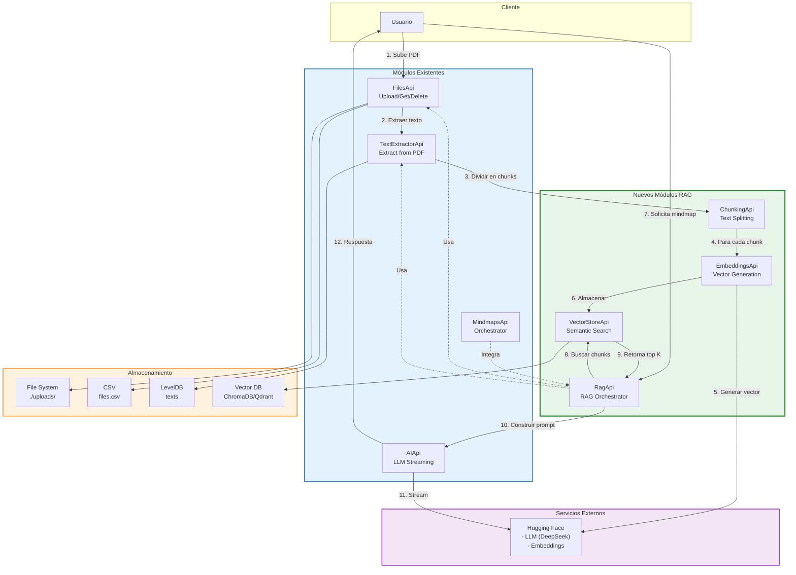
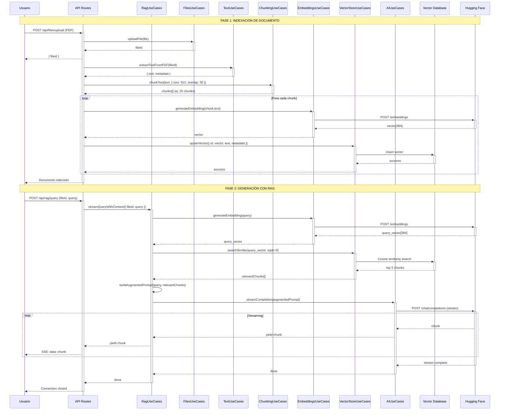
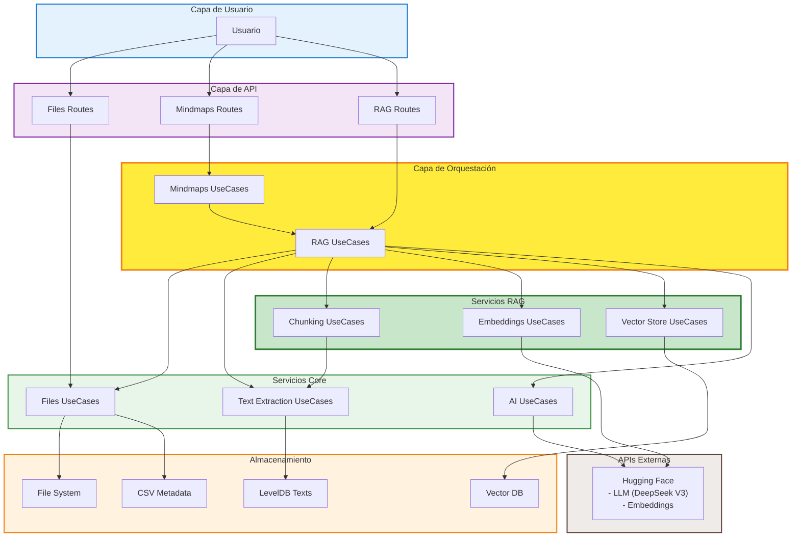

# Propuesta de Arquitectura RAG para MindmapAI

## Resumen Ejecutivo

Esta propuesta detalla la integración de un flujo **RAG (Retrieval-Augmented Generation)** en la arquitectura existente de MindmapAI. El objetivo es permitir que el sistema genere mindmaps más precisos y contextuales mediante la recuperación de información relevante antes de la generación.

---

## Nuevos Módulos a Añadir

### 1. **Módulo: `embeddings/`** - Generación de Embeddings

**Responsabilidad**: Convertir texto en vectores numéricos para búsqueda semántica.

```
src/backend/embeddings/
├── @core-contracts/
│   ├── embeddingsApi.ts          # Interface EmbeddingsApi
│   ├── dtos.ts                    # DTOs: EmbeddingDTO, GenerateEmbeddingParams
│   ├── providers.ts               # Interface EmbeddingProvider
│   └── services.ts                # Interface EmbeddingService
├── application/
│   └── UseCases.ts                # EmbeddingsUseCases - lógica de generación
├── infrastructure/
│   ├── providers/
│   │   ├── HuggingFaceEmbeddings.ts    # Hugging Face embeddings
│   │   ├── OpenAIEmbeddings.ts         # OpenAI embeddings (opcional)
│   │   └── LocalEmbeddings.ts          # Modelo local (transformers.js)
│   └── routes/
│       └── AstroRouter.ts         # Handlers HTTP para embeddings
└── index.ts
```

**Interfaces Principales**:

```typescript
// embeddingsApi.ts
interface EmbeddingsApi {
  generateEmbedding(text: string): Promise<number[]>
  generateEmbeddings(texts: string[]): Promise<number[][]>
}

// dtos.ts
interface EmbeddingDTO {
  text: string
  vector: number[]
  dimension: number
  model: string
}

interface GenerateEmbeddingParams {
  text: string
  model?: string
}
```

---

### 2. **Módulo: `vectorStore/`** - Almacenamiento de Vectores

**Responsabilidad**: Indexar, almacenar y buscar vectores para retrieval semántico.

```
src/backend/vectorStore/
├── @core-contracts/
│   ├── vectorStoreApi.ts          # Interface VectorStoreApi
│   ├── dtos.ts                    # DTOs: VectorDTO, SearchParams, SearchResult
│   ├── repository.ts              # Interface VectorRepository
│   └── services.ts                # Interface VectorSearch
├── application/
│   └── UseCases.ts                # VectorStoreUseCases - lógica de búsqueda
├── infrastructure/
│   ├── repositories/
│   │   ├── ChromaDBRepository.ts       # ChromaDB adapter
│   │   ├── PineconeRepository.ts       # Pinecone adapter (cloud)
│   │   ├── QdrantRepository.ts         # Qdrant adapter (local/cloud)
│   │   └── SimpleLevelDBRepository.ts  # LevelDB simple (sin índice)
│   └── routes/
│       └── AstroRouter.ts         # Handlers HTTP para vectores
├── Domain/
│   └── VectorDocument.ts          # Entidad VectorDocument
└── index.ts
```

**Interfaces Principales**:

```typescript
// vectorStoreApi.ts
interface VectorStoreApi {
  upsertVector(params: UpsertVectorParams): Promise<void>
  searchSimilar(query: number[], topK: number): Promise<SearchResult[]>
  deleteVector(id: string): Promise<void>
  deleteBySourceId(sourceId: string): Promise<void>
}

// dtos.ts
interface VectorDTO {
  id: string
  vector: number[]
  metadata: {
    sourceId: string
    chunkIndex: number
    text: string
    timestamp: number
  }
}

interface SearchResult {
  id: string
  score: number
  text: string
  metadata: Record<string, any>
}

interface SearchParams {
  query: string
  topK: number
  filters?: Record<string, any>
}
```

---

### 3. **Módulo: `chunking/`** - División de Texto

**Responsabilidad**: Dividir documentos grandes en chunks semánticamente coherentes.

```
src/backend/chunking/
├── @core-contracts/
│   ├── chunkingApi.ts             # Interface ChunkingApi
│   ├── dtos.ts                    # DTOs: ChunkDTO, ChunkingParams
│   └── services.ts                # Interface TextChunker
├── application/
│   └── UseCases.ts                # ChunkingUseCases - lógica de división
├── infrastructure/
│   ├── chunkers/
│   │   ├── RecursiveTextChunker.ts     # División recursiva por caracteres
│   │   ├── SemanticChunker.ts          # División semántica (embeddings)
│   │   └── MarkdownChunker.ts          # División respetando estructura MD
│   └── routes/
│       └── AstroRouter.ts         # Handlers HTTP para chunking
└── index.ts
```

**Interfaces Principales**:

```typescript
// chunkingApi.ts
interface ChunkingApi {
  chunkText(text: string, options: ChunkingOptions): Promise<ChunkDTO[]>
  chunkDocument(docId: string): Promise<ChunkDTO[]>
}

// dtos.ts
interface ChunkDTO {
  id: string
  text: string
  index: number
  sourceId: string
  metadata: {
    startChar: number
    endChar: number
    tokens?: number
  }
}

interface ChunkingOptions {
  chunkSize: number          // Tamaño en caracteres/tokens
  chunkOverlap: number       // Solapamiento entre chunks
  strategy: 'recursive' | 'semantic' | 'markdown'
  separators?: string[]      // Separadores personalizados
}
```

---

### 4. **Módulo: `rag/`** - Orquestación RAG

**Responsabilidad**: Orquestar el flujo completo de Retrieval-Augmented Generation.

```
src/backend/rag/
├── @core-contracts/
│   ├── ragApi.ts                  # Interface RagApi
│   ├── dtos.ts                    # DTOs: RagQueryParams, RagResult
│   └── services.ts                # Interface RagOrchestrator
├── application/
│   └── UseCases.ts                # RagUseCases - orquestación completa
├── infrastructure/
│   ├── routes/
│   │   └── AstroRouter.ts         # Handlers HTTP para RAG
│   └── prompts/
│       ├── mindmapPrompt.ts       # Templates de prompts
│       └── contextBuilder.ts      # Constructor de contexto
└── index.ts
```

**Interfaces Principales**:

```typescript
// ragApi.ts
interface RagApi {
  queryWithContext(params: RagQueryParams): Promise<RagResult>
  streamQueryWithContext(params: RagQueryParams): AsyncGenerator<string>
  indexDocument(docId: string): Promise<void>
  deleteDocumentIndex(docId: string): Promise<void>
}

// dtos.ts
interface RagQueryParams {
  query: string
  sourceId?: string           // Limitar búsqueda a documento específico
  topK: number                // Número de chunks a recuperar
  includeContext: boolean     // Incluir contexto en respuesta
}

interface RagResult {
  answer: string
  context: ContextChunk[]
  sources: string[]
}

interface ContextChunk {
  text: string
  score: number
  sourceId: string
  chunkIndex: number
}
```

---

## Arquitectura RAG Completa con Módulos Existentes

```
src/backend/
├── AI/                    # EXISTENTE - Generación con LLM
├── files/                 # EXISTENTE - Gestión de archivos
├── textExtraction/        # EXISTENTE - Extracción de texto
├── mindmaps/              # EXISTENTE - Generación de mindmaps
├── shared/                # EXISTENTE - Código compartido
│
├── chunking/              # NUEVO - División de texto
├── embeddings/            # NUEVO - Generación de vectores
├── vectorStore/           # NUEVO - Búsqueda vectorial
└── rag/                   # NUEVO - Orquestación RAG
```

---

## Flujo de Datos RAG Completo

### Fase 1: Indexación de Documentos

```
1. Usuario sube PDF
   ↓
2. FilesApi.uploadFile()
   → Guarda archivo en filesystem + CSV
   ↓
3. TextExtractorApi.extractTextFromPDF()
   → Extrae texto + metadata
   ↓
4. ChunkingApi.chunkText()
   → Divide texto en chunks semánticos
   ↓
5. Para cada chunk:
   ├─→ EmbeddingsApi.generateEmbedding()
   │   → Genera vector del chunk
   │   ↓
   └─→ VectorStoreApi.upsertVector()
       → Almacena vector + texto + metadata
       ↓
6. Documento indexado y listo para RAG
```

### Fase 2: Generación de Mindmap con RAG

```
1. Usuario solicita mindmap de un documento
   ↓
2. RagApi.streamQueryWithContext()
   │
   ├─→ Paso 1: Preparar query
   │   ├─→ Query inicial: "genera mindmap del documento"
   │   └─→ Opcionalmente enriquecer con keywords
   │
   ├─→ Paso 2: Generar embedding de la query
   │   └─→ EmbeddingsApi.generateEmbedding(query)
   │       → vector_query: [0.23, -0.45, ...]
   │
   ├─→ Paso 3: Búsqueda de chunks relevantes
   │   └─→ VectorStoreApi.searchSimilar(vector_query, topK=5)
   │       → Retorna los 5 chunks más similares
   │       → Ejemplo:
   │         [
   │           { text: "...", score: 0.92 },
   │           { text: "...", score: 0.87 },
   │           ...
   │         ]
   │
   ├─→ Paso 4: Construir contexto aumentado
   │   └─→ contextBuilder.buildContext(chunks)
   │       → Combina chunks en contexto coherente
   │       → Añade metadata relevante
   │
   ├─→ Paso 5: Generar prompt mejorado
   │   └─→ mindmapPrompt.buildPrompt({
   │         context: chunks_relevantes,
   │         query: "genera mindmap",
   │         format: "markmap"
   │       })
   │       → Prompt final:
   │         """
   │         Contexto relevante del documento:
   │         [chunk 1 con score 0.92]
   │         [chunk 2 con score 0.87]
   │         ...
   │
   │         Tarea: Genera un mindmap en formato Markmap
   │         que capture los conceptos principales.
   │         """
   │
   └─→ Paso 6: Streaming con IA
       └─→ AIApi.streamCompletion(prompt_mejorado)
           → Stream de texto con contexto preciso
           ↓
3. Cliente recibe mindmap más preciso y contextual
```

---

## Diagrama de Arquitectura RAG



---

## Flujo de Secuencia Detallado: RAG End-to-End



---

## Dependencias Técnicas Recomendadas

### Nuevas Dependencias NPM

```json
{
  "dependencies": {
    // Embeddings
    "@huggingface/inference": "^2.6.1",          // Hugging Face embeddings
    "@xenova/transformers": "^2.10.0",           // Embeddings locales (opcional)

    // Vector Stores
    "chromadb": "^1.7.3",                        // ChromaDB (recomendado local)
    "qdrant-client": "^1.8.0",                   // Qdrant (alternativa)
    "@pinecone-database/pinecone": "^1.1.0",     // Pinecone (cloud, opcional)

    // Text Chunking
    "langchain": "^0.1.25",                      // Utilidades de chunking
    "tiktoken": "^1.0.10",                       // Conteo de tokens

    // Búsqueda y Similarity
    "hnswlib-node": "^2.0.0",                    // HNSW index (opcional)
    "vectra": "^0.4.0",                          // Vector store local simple

    // Utilidades
    "cohere-ai": "^7.7.0",                       // Cohere embeddings (alternativa)
    "openai": "^4.28.0"                          // OpenAI embeddings (alternativa)
  }
}
```

### Modelos Recomendados para Embeddings

| Modelo | Dimensiones | Descripción | Uso |
|--------|-------------|-------------|-----|
| **sentence-transformers/all-MiniLM-L6-v2** | 384 | Ligero, rápido | Desarrollo local |
| **sentence-transformers/all-mpnet-base-v2** | 768 | Balance calidad/velocidad | Producción general |
| **BAAI/bge-small-en-v1.5** | 384 | Alta calidad, pequeño | RAG español/inglés |
| **text-embedding-3-small** (OpenAI) | 1536 | Alta calidad, API | Producción cloud |
| **embed-multilingual-v3.0** (Cohere) | 1024 | Multilenguaje | Documentos multilingües |

---

## Opciones de Vector Stores

### Opción 1: ChromaDB (Recomendado para inicio)

**Pros**:
- Fácil instalación (npm install chromadb)
- Embeddings opcionales integrados
- Persistencia local
- API simple
- Sin configuración compleja

**Contras**:
- Limitado en escala (< 1M vectores)

```typescript
// Ejemplo de uso
import { ChromaClient } from 'chromadb'

const client = new ChromaClient({ path: './database/chroma' })
const collection = await client.getOrCreateCollection({ name: 'documents' })

await collection.add({
  ids: ['chunk1'],
  embeddings: [[0.1, 0.2, ...]],
  metadatas: [{ sourceId: 'doc1', text: '...' }]
})

const results = await collection.query({
  queryEmbeddings: [[0.1, 0.2, ...]],
  nResults: 5
})
```

### Opción 2: Qdrant (Recomendado para producción)

**Pros**:
- Alta performance
- Escalable (millones de vectores)
- Filtros avanzados
- Deployment local o cloud
- Búsqueda híbrida (vectorial + filtros)

**Contras**:
- Requiere servidor separado (Docker)

```typescript
// Ejemplo de uso
import { QdrantClient } from '@qdrant/js-client-rest'

const client = new QdrantClient({ url: 'http://localhost:6333' })

await client.upsert('documents', {
  points: [{
    id: 'chunk1',
    vector: [0.1, 0.2, ...],
    payload: { sourceId: 'doc1', text: '...' }
  }]
})

const results = await client.search('documents', {
  vector: [0.1, 0.2, ...],
  limit: 5
})
```

### Opción 3: LevelDB Simple (Sin índice, no recomendado)

**Solo para POC**, búsqueda lineal sin optimización.

---

## Estrategias de Chunking

### 1. Recursive Character Text Splitter (Básico)

```typescript
{
  chunkSize: 512,           // 512 caracteres por chunk
  chunkOverlap: 50,         // 50 caracteres de solapamiento
  separators: ['\n\n', '\n', '. ', ' ']
}
```

**Pros**: Simple, rápido
**Contras**: No respeta semántica

### 2. Semantic Chunker (Avanzado)

Usa embeddings para detectar cambios semánticos.

```typescript
{
  strategy: 'semantic',
  maxChunkSize: 512,
  similarityThreshold: 0.7  // Split cuando similarity < 0.7
}
```

**Pros**: Chunks semánticamente coherentes
**Contras**: Más lento (requiere embeddings)

### 3. Markdown Structure Chunker (Para documentos estructurados)

Respeta headers, listas, secciones.

```typescript
{
  strategy: 'markdown',
  respectHeaders: true,      // No divide en medio de secciones
  maxChunkSize: 1000
}
```

**Pros**: Preserva estructura del documento
**Contras**: Solo para Markdown/HTML

---

## Configuración de Embeddings

### Opción A: Hugging Face (Recomendado)

```typescript
// infrastructure/providers/HuggingFaceEmbeddings.ts
import { HfInference } from '@huggingface/inference'

class HuggingFaceEmbeddings implements EmbeddingProvider {
  private hf = new HfInference(process.env.HF_API_KEY)

  async generateEmbedding(text: string): Promise<number[]> {
    const result = await this.hf.featureExtraction({
      model: 'sentence-transformers/all-MiniLM-L6-v2',
      inputs: text
    })
    return result as number[]
  }
}
```

### Opción B: Local con Transformers.js (Sin API)

```typescript
// infrastructure/providers/LocalEmbeddings.ts
import { pipeline } from '@xenova/transformers'

class LocalEmbeddings implements EmbeddingProvider {
  private extractor = await pipeline('feature-extraction',
    'Xenova/all-MiniLM-L6-v2'
  )

  async generateEmbedding(text: string): Promise<number[]> {
    const output = await this.extractor(text, {
      pooling: 'mean',
      normalize: true
    })
    return Array.from(output.data)
  }
}
```

**Ventajas local**: Sin costo API, privacidad
**Desventajas**: Más lento, requiere más RAM

---

## Mejoras al Prompt con RAG

### Antes (Sin RAG):

```typescript
const prompt = `
Genera un mindmap en formato Markmap sobre el siguiente texto:

${fullText}  // Texto completo (puede ser muy largo)
`
```

**Problemas**:
- Límite de tokens del LLM
- Pierde contexto importante
- Menos preciso con documentos largos

### Después (Con RAG):

```typescript
const prompt = `
Eres un experto en crear mapas mentales estructurados.

CONTEXTO RELEVANTE DEL DOCUMENTO:
${relevantChunks.map((chunk, i) => `
[Fragmento ${i+1} - Relevancia: ${chunk.score.toFixed(2)}]
${chunk.text}
`).join('\n---\n')}

TAREA:
Genera un mindmap en formato Markmap que capture los conceptos principales
del documento basándote en los fragmentos relevantes proporcionados.

FORMATO REQUERIDO:
- Usa sintaxis Markmap (Markdown con jerarquía)
- Incluye máximo 5 niveles de profundidad
- Agrupa conceptos relacionados
`
```

**Ventajas**:
- Solo envía información relevante
- Respeta límites de tokens
- Mayor precisión en la generación
- Cita fuentes específicas

---

## Endpoints de API Propuestos

### Indexación

```
POST /api/rag/index/:fileId
Body: { chunkingOptions: {...} }
Response: { indexed: true, chunksCount: 25, vectorsStored: 25 }
```

### Query con RAG

```
POST /api/rag/query
Body: {
  query: "genera mindmap",
  sourceId: "doc123",
  topK: 5
}
Response: Stream de texto generado con contexto
```

### Búsqueda de chunks relevantes

```
POST /api/rag/search
Body: { query: "conceptos principales", sourceId: "doc123", topK: 3 }
Response: {
  chunks: [
    { text: "...", score: 0.92, chunkIndex: 5 },
    { text: "...", score: 0.87, chunkIndex: 12 }
  ]
}
```

### Eliminación de índice

```
DELETE /api/rag/index/:sourceId
Response: { deleted: true, vectorsRemoved: 25 }
```

---

## Integración con Mindmaps Existente

### Modificación Conceptual en `mindmaps/UseCases`:

```typescript
class UseCases implements MindmapsApi {
  constructor(
    private filesApi: FilesApi,
    private textExtractorApi: TextExtractorApi,
    private aiApi: AIApi,
    private ragApi: RagApi  // NUEVA DEPENDENCIA
  ) {}

  async* selectFileAndGenerateMindmapWithRAG(id: string, fileId: string) {
    // 1. Verificar si documento ya está indexado
    const isIndexed = await this.ragApi.isDocumentIndexed(fileId)

    if (!isIndexed) {
      // 2. Indexar documento (una sola vez)
      await this.ragApi.indexDocument(fileId)
    }

    // 3. Generar mindmap con contexto RAG
    const query = "genera un mindmap completo del documento"
    const stream = this.ragApi.streamQueryWithContext({
      query,
      sourceId: fileId,
      topK: 5
    })

    // 4. Stream al cliente
    for await (const chunk of stream) {
      yield chunk
    }
  }
}
```

---

## Consideraciones de Performance

### Indexación

| Documento | Tamaño | Chunks | Embeddings | Tiempo |
|-----------|--------|--------|------------|--------|
| PDF 10 páginas | 50 KB | ~25 chunks | 25 vectores | ~5-10s |
| PDF 100 páginas | 500 KB | ~250 chunks | 250 vectores | ~30-60s |
| PDF 500 páginas | 2.5 MB | ~1250 chunks | 1250 vectores | ~3-5 min |

**Optimización**: Indexación asíncrona en background con job queue.

### Búsqueda (Query)

| Vector DB | Vectores | Latencia | Throughput |
|-----------|----------|----------|------------|
| ChromaDB | 10K | ~50ms | ~20 req/s |
| ChromaDB | 100K | ~200ms | ~5 req/s |
| Qdrant | 1M | ~10ms | ~100 req/s |
| Qdrant | 10M | ~50ms | ~50 req/s |

**Optimización**: Cache de embeddings frecuentes.

---

## Roadmap de Implementación

### Fase 1: MVP (2-3 semanas)
1. Módulo `chunking` con estrategia básica (recursive)
2. Módulo `embeddings` con Hugging Face
3. Módulo `vectorStore` con ChromaDB
4. Integración básica en endpoint `/api/rag/query`

### Fase 2: Optimización (1-2 semanas)
1. Chunking semántico
2. Cache de embeddings
3. Indexación asíncrona (job queue)
4. Métricas de relevancia

### Fase 3: Producción (1-2 semanas)
1. Migrar a Qdrant
2. Búsqueda híbrida (vectorial + filtros)
3. Re-ranking de resultados
4. Monitoreo y analytics

---

## Comparación: Con vs Sin RAG

### Sin RAG (Actual)

```
Documento 100 páginas
  ↓
Extraer todo el texto (500 KB)
  ↓
Enviar todo al LLM ❌ (Límite de tokens)
  ↓
O enviar resumen ❌ (Pierde detalles)
  ↓
Mindmap genérico e impreciso
```

### Con RAG (Propuesto)

```
Documento 100 páginas
  ↓
Indexar en 250 chunks + vectores
  ↓
Usuario: "genera mindmap"
  ↓
Buscar top 5 chunks relevantes (vectorial)
  ↓
Enviar solo 5 chunks al LLM ✓ (Dentro de límites)
  ↓
Mindmap preciso, contextual, y completo
```

**Beneficio clave**: Maneja documentos de cualquier tamaño sin perder precisión.

---

## Resumen de Módulos RAG

| Módulo | Responsabilidad | Tecnología Recomendada | Prioridad |
|--------|----------------|------------------------|-----------|
| **chunking** | Dividir texto | LangChain utilities | Alta |
| **embeddings** | Generar vectores | Hugging Face API | Alta |
| **vectorStore** | Búsqueda semántica | ChromaDB → Qdrant | Alta |
| **rag** | Orquestación RAG | Custom logic | Alta |

---

## Diagrama Final: Arquitectura Completa con RAG



---

## Conclusión

La integración de RAG en MindmapAI permitirá:

1. **Manejar documentos de cualquier tamaño** sin límites de tokens
2. **Generar mindmaps más precisos** con contexto relevante
3. **Búsqueda semántica** de información en documentos
4. **Escalabilidad** para miles de documentos indexados
5. **Flexibilidad** para diferentes tipos de queries (mindmaps, resúmenes, Q&A)

La arquitectura propuesta mantiene la separación de responsabilidades y permite una implementación incremental, comenzando con ChromaDB y migrando a Qdrant cuando sea necesario escalar.
